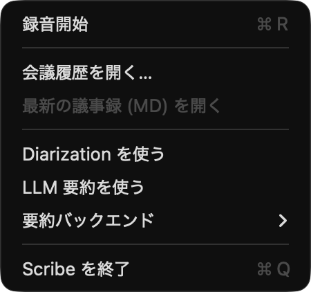

[English](README.md) | [日本語](README.ja.md)

# osnap

`osnap` is a small macOS screenshot CLI for capturing exactly what you ask for —
a screen rectangle, a single window, every window of an app, or a menu-bar
extra's popup — and nothing else. The goal is to make scripted screenshots
trustworthy: no other apps' content leaks into the image, no full-screen capture
when you only needed a button.

It was built to produce documentation screenshots for a menu-bar app, where
ordinary tools either captured the entire desktop or required manual clicks
that could not be automated.

## Features

- `region`, `window`, `app` — three targeted capture modes that wrap
  `screencapture(1)` with safer defaults and structured output paths.
- `menubar-popup` — opens a running app's menu-bar extra via the Accessibility
  API and captures only the resulting popup window.
- `popup-wait` — snapshots the current window list, then waits for any new
  popup to appear and captures just that. Useful when a menu must be opened by
  hand or by a separate AppleScript.
- `list` — enumerates capturable windows with `CGWindowID`, owner, layer,
  bounds, and title. Pipes well into shell scripts.

## Demo

A menu-bar extra popup, captured with `osnap`:



The image is exactly the popup window — no surrounding desktop, no other apps,
no menu-bar strip. The corresponding pipeline:

```
osascript -e 'tell application "System Events" to tell process "<app>" \
    to click menu bar item 1 of menu bar 2'
ID=$(osnap list --include-menu | awk '/<app>/ {print $1; exit}')
osnap window "$ID" --out popup.png
```

Or, when the app supports Accessibility automation:

```
osnap menubar-popup <app> --out popup.png
```

## Requirements

- macOS 13 or later.
- Swift 5.9 toolchain (Xcode 15+ or the standalone Swift toolchain).
- Screen Recording permission for the process running `osnap` (granted once
  per binary, in System Settings → Privacy & Security → Screen & System Audio
  Recording).
- Accessibility permission only for `osnap menubar-popup`. Grant it to the
  binary at System Settings → Privacy & Security → Accessibility. The other
  subcommands do not need it.

## Install

From source:

```
git clone https://github.com/Daiki-Iijima/osnap.git    # placeholder URL
cd osnap
swift build -c release
cp .build/release/osnap /usr/local/bin/                # or anywhere on PATH
```

There is currently no Homebrew formula. If you want one, open an issue.

## Subcommands

| Command | Captures | AX permission |
|---|---|---|
| `osnap list` | nothing — prints window inventory | no |
| `osnap region X,Y,W,H --out f.png` | a screen rectangle (logical points, top-left origin) | no |
| `osnap window <id> --out f.png` | a single `CGWindowID` | no |
| `osnap app <name> --out prefix` | every visible window of an app | no |
| `osnap menubar-popup <app> --out f.png` | an app's menu-bar extra popup, opened automatically | yes |
| `osnap popup-wait --out f.png` | the next new popup window to appear | no |

### `list`

```
osnap list                              # on-screen, non-menu windows
osnap list --app "Google Chrome"        # filter by owner substring
osnap list --include-menu               # also include menu / popup layer windows
```

Each row: `windowID  layer  owner  title  WxH @ X,Y`.

### `region`

```
osnap region 100,200,800,400 --out region.png
```

Arguments are X, Y, width, height in **logical points** (Retina scaling
applied by `screencapture`). Top-left origin.

### `window`

```
osnap window 1234 --out chrome.png
```

`window` captures one CGWindowID even if it is partially off-screen, and
preserves window-shape masking (rounded corners, popovers).

### `app`

```
osnap app Finder --out finder
# → finder-1.png, finder-2.png, ...
```

Use `--include-menu` to also capture menu-layer windows the app owns.

### `menubar-popup`

```
osnap menubar-popup MeetingMinutes --out menu.png --settle-ms 250
```

The first time you run it, macOS prompts for Accessibility permission. If you
deny it, fall back to `popup-wait` and open the menu by hand.

Internally:

1. Find the running application by name or bundle ID.
2. Read its `AXExtrasMenuBar` (or `AXMenuBar`) and try `AXShowMenu`,
   `AXPress`, `AXOpen` in that order on each menu-bar item until one succeeds.
3. Wait `--settle-ms` for the popup to render.
4. Identify the new high-layer window and capture only it.

For SwiftUI `MenuBarExtra` apps where Accessibility actions are not exposed,
prefer the AppleScript fallback:

```
osascript -e 'tell application "System Events" to tell process "<app>" \
    to click menu bar item 1 of menu bar 2'
osnap popup-wait --out menu.png
```

### `popup-wait`

```
osnap popup-wait --out popup.png --timeout 30 --owner MeetingMinutes
```

Useful when:

- You want to open the menu manually for a specific state.
- The target app is not Accessibility-friendly.
- You are scripting another tool (AppleScript, `cliclick`, …) that does the
  clicking.

`--owner` is a case-insensitive substring filter on the new window's owner
name. `--min-height` rejects tiny windows (notification badges, tooltips).

## Limitations

- `osnap` only sees windows the current user session can see. It will not
  capture content rendered with the `kCGWindowSharingNone` flag (some
  password fields, DRM video, Screen Time blocked apps).
- The Accessibility hierarchy varies by app. SwiftUI's `MenuBarExtra` exposes
  an `AXExtrasMenuBar` whose items may not respond to `AXPress`, in which
  case `menubar-popup` will fail and you should use the AppleScript +
  `popup-wait` recipe.
- macOS 26 ships with a per-app Screen Recording prompt model. After a
  major OS update you may need to re-grant the permission.

## Building from source

```
swift build -c release
.build/release/osnap --help
```

To run the tests (none yet; contributions welcome):

```
swift test
```

## Why not …

- `screencapture -R x,y,w,h` — same idea for `region`. `osnap region` wraps it
  with named flags and adds the window-ID discovery (`list`, `app`,
  `popup-wait`) needed for everything else.
- `screencapture -w` (interactive window pick) — needs a human click; no good
  in scripts.
- AppleScript alone — can click menu items but cannot tell `screencapture`
  *which* of the resulting windows it just opened. `osnap` does that lookup.

## Project layout

```
Sources/osnap/main.swift       all source, single file
Package.swift                  SwiftPM manifest
Package.resolved               pinned ArgumentParser version
```

## Status

v0.1. Pre-1.0; CLI flags may change. Tested on macOS 26 (Tahoe) only.

## License

MIT. See [`LICENSE`](LICENSE).
